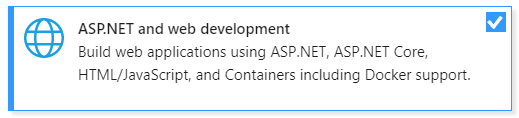
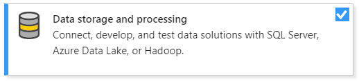

# Der-Wetterstation

Der-Wetterstation is a smart home assistant which provides you information about temperature and humidity. This information is accessible via a web-fronted and also via Alexa-Skill.

Used technologies are :
  - Tivia C Launchboard with HTU-21 click board for measuring the temperature & humidity
  - Amazon ASK CLI with node.js for providing the Alexa Skill with corresponding Lambda function
  - .NET for Webfrontend & REST-API


# How does it work?
The µC measures the temperature and the humidity which afterwards is getting post to a database in a parameterized intervall. The data post happens via a REST call from the µC to the provided backend. The data is getting processed by the backend. The frontend application shows the data which is stored in the database. The Alexa skill is accesing the data by REST-API which is also provided by the backend.

The smarthome assistent consists of three packages(folders within this project):
- der-wetterstation: code of the alexa skill
- tivia-c: code of the µC
- frontend&backend: code of frontend and backend

# Todos

 - add security concept
 - add proper exception handling


 
   # Alexa Skill - ESE SmartHome

   ## Getting Started

   These instructions will help you to install and test the skill.

   ### Prerequisites

   * Install [Visual Studio Code 2017](https://code.visualstudio.com/)
   * Install [nodeJS](https://nodejs.org/en/)
   * Install [npm](https://www.npmjs.com/)
   * Install [ASK CLI](https://developer.amazon.com/docs/smapi/quick-start-alexa-skills-kit-command-line-interface.html)
   * Set Up AWS Account & AWS Lambda [Amazon Guide](https://developer.amazon.com/docs/smapi/set-up-credentials-for-an-amazon-web-services-account.html)

   ## Install & Deploy

   Clone the Skill:
  ```console
  mac:Desktop salko.n$ ask clone -s amzn1.ask.skill.300834f2-a9ae-4c64-8925-ce1e6f1397a5
  -------------------- Clone Skill Project --------------------
  Project directory for der-wetterstation created at
      ./der-wetterstation

  Skill schema for der-wetterstation created at
      ./der-wetterstation/skill.json

  Skill model for de-DE created at
      ./der-wetterstation/models/de-DE.json

  Downloading Lambda functions...
      arn:aws:lambda:us-east-1:032256760661:function:ask-custom-der-wetterstation-default download finished.
  ```

  Change directory:
  ```console
 mac:Desktop salko.n$ cd der-wetterstation/
  ```

  Deploy:
  ```console
 mac:Desktop salko.n$ ask deploy
  ```

  Now you test your Skill via the cli:

```console
mac:Desktop salko.n$  ask simulate -t "alexa frage bestes projekt nach küche" -l "de-DE"
✓ Simulation created for simulation id: 9cc3297d-256c-4304-af5a-0bb1af87734e
◝ Waiting for simulation response{

  [...]
          "request": {
            "type": "IntentRequest",
            "requestId": "amzn1.echo-api.request.f8a489f7-bd0f-4735-9dba-578e60ffc9c0",
            "timestamp": "2018-07-02T15:32:01Z",
            "locale": "de-DE",
            "intent": {
              "name": "status",
              "confirmationStatus": "NONE",
              "slots": {
                "deviceID": {
                  "name": "deviceID",
                  "value": "küche",
                  "confirmationStatus": "NONE"
                }
              }
            },
            "dialogState": "STARTED"
          }
        }
      },
      "invocationResponse": {
        "body": {
          "response": {
            "outputSpeech": {
              "type": "PlainText",
              "text": "Vielen Dank, dass du das beste Projekt nutzt. Die Temperatur in deinem küche beträgt 27,49 Grad Celsius, und die Luftfeuchtigkeit beträgt 35 Prozent"
            },
            "shouldEndSession": true
          }
        }
      },
      "metrics": {
        "skillExecutionTimeInMilliseconds": 411
      }
    }
  }
}
```

   ## Skill - Authors

   * **Salko Nuhanovic**

# Web App - ESE SmartHome

## Getting Started

These instructions will get you a copy of the project up and running on your local machine for development and testing purposes.

### Prerequisites

* Install [Visual Studio 2017](https://visualstudio.microsoft.com/downloads/?utm_medium=microsoft&utm_source=docs.microsoft.com&utm_campaign=button+cta&utm_content=download+vs2017) which is available for free as a Community Edition

* When installing Visual Studio select the **ASP.NET and web development** workload



* If you have not already installed MsSQL-LocalDB, please select the **Data storage and processing** workload as well



* Finally you need the current [.Net Core SDK](https://www.microsoft.com/net/download/dotnet-core/)

### Installing

After obtaining ESE SmaratHome by cloning from the repository or extracting the compressed file, the solution can be opened directly in Visual Studio or by double-clicking the ese.smarthome.sln file.

In order to successfully start the Web App you have to build it first.
This can be done either by using the context menu directly on the solution inside the Solution Explorer or by using the `F6` short key.
This will ensure that the required Nuget packages and other project dependencies are loaded correctly.

Finally, you must create the required database by running the following commands in the `Package Manager Console` in Visual Studio.

```
Add-Migration Init -Project ese.smarthome.core -StartupProject ese.smarthome -Output Db\Migrations
```
This commands creates a migration files inside the ese.smarthome.core project folder Db\Migrations

```
Update-Database -Project ese.smarthome.core -StartupProject ese.smarthome
```
This command creates the database and all required tables.

>### Note
>You can find other useful commands in the [migrations.md](web.app/ese.smarthome/docs/migrations.md) document.

### Configuration

You can find the configuration settings in the [`appsettings.json`](web.app/ese.smarthome/src/ese.smarthome/appsettings.json) file.

* `ConnectionStrings` - Used for the Db-Connection
* [`Serilog`](https://serilog.net/) - Settings for Logging

If everything went well, you can start the web app by pressing `F5`.

## Disclaimer

* **NOT** intended to be a definitive solution
* Beware to use in production way

ESE SmartHome was developed as part of the Embedded Systems Engineering course of the Bachelor's degree in Information and Communication Systems and Services at the University of Applied Sciences [FH Technikum](https://www.technikum-wien.at/) in Vienna.

The main goals of the project are
* implement a simple embedded systems project
* use – and if necessary – adapt complex software libraries
* combine subsystems to complex (distributed) systems considering communication requirements
* select, define, integrate, and adapt COTS (commercial off-the-shelf) and non-COTS components for embedded systems

As a result, key components of productive systems such as privacy and data security have been largely ignored.

## Built With

* [Visual Studio 2017](https://www.visualstudio.com/) - Microsofts powerful IDE
* [SQL Operations Studio](https://docs.microsoft.com/en-us/sql/sql-operations-studio/what-is?view=sql-server-2017) - Tool to manage Azure Database
* Written in C#

## Technologies Implemented

* ASP.NET Core 2.0 (with .NET Core)
* ASP.NET MVC Core
* .NET Core Native DI
* Entity Framework Core 2.1
* [Azure Cloud](https://azure.microsoft.com/en-us/)
* [Swagger](https://github.com/domaindrivendev/Swashbuckle) - API Explorer
* [AutoMapper](https://automapper.org/)
* [MediatR](https://github.com/jbogard/MediatR) - CQRS
* [Serilog](https://serilog.net/)
* [OdeToCode](https://github.com/OdeToCode/AddFeatureFolders) - Feature Folders

## JavaScript, CSS and Tools

* [Gulp](https://gulpjs.com/) - To simplify the development activity
* [Bootstrap](https://getbootstrap.com/) - For responsive design
* [jQuery](https://jquery.com/)
* [Font Awesome](https://fontawesome.com/)
* [Parallax.js](http://pixelcog.github.io/parallax.js/)
* [Popper.js](https://popper.js.org/)
* [Bootstrap Toggle](http://www.bootstraptoggle.com/)

## Architecture & Patterns

* MVC
* [CQRS](https://martinfowler.com/bliki/CQRS.html)
* DDD
* Repository
* Unit of Work

## Web App - Authors

* **Nöhrer Stephan**

## Acknowledgments

* [Pexels](https://www.pexels.com/) - Free images licensed under Creative Commons Zero
* [stackoverflow](https://stackoverflow.com/) - Lifesaver
* [coffee](https://en.wikipedia.org/wiki/Coffee) - THE drink
